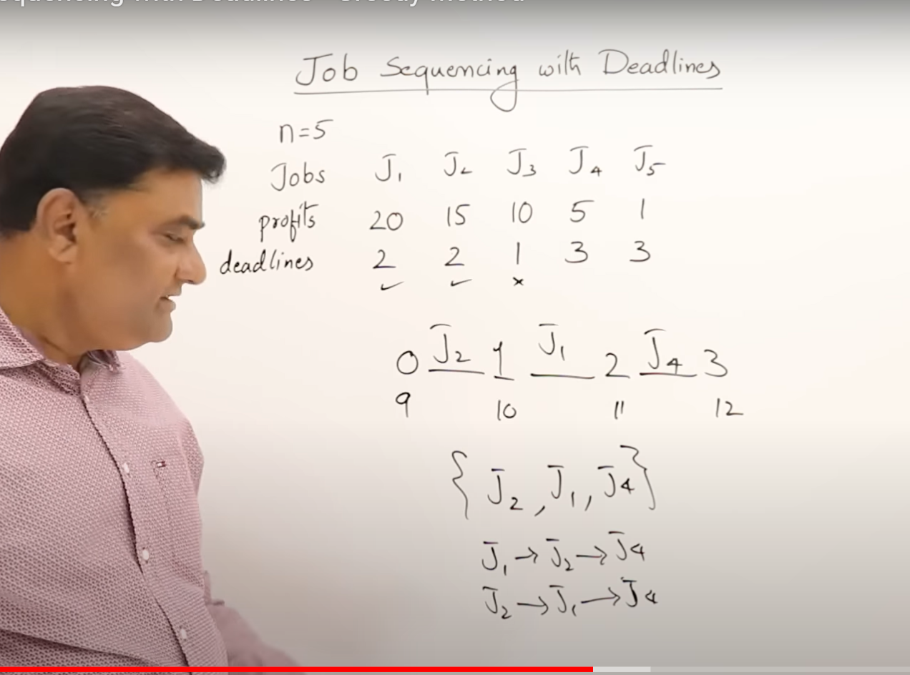
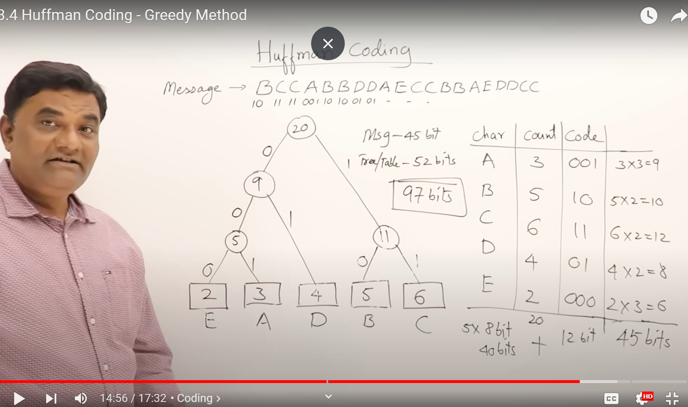
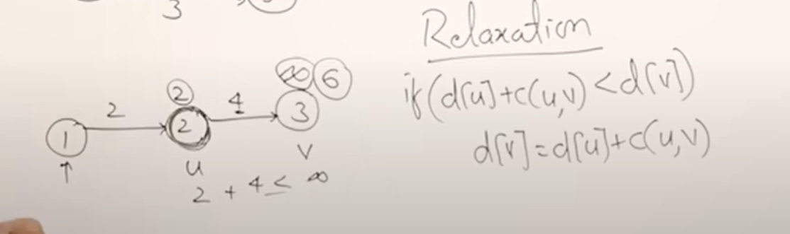
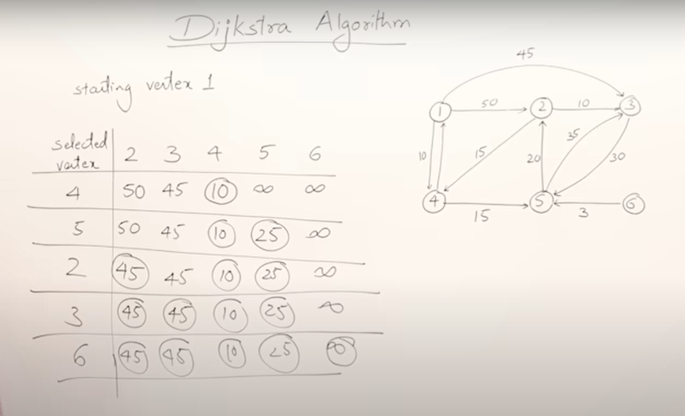
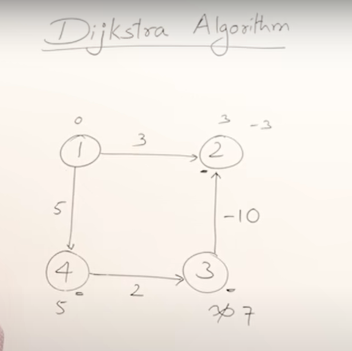
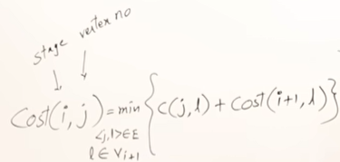
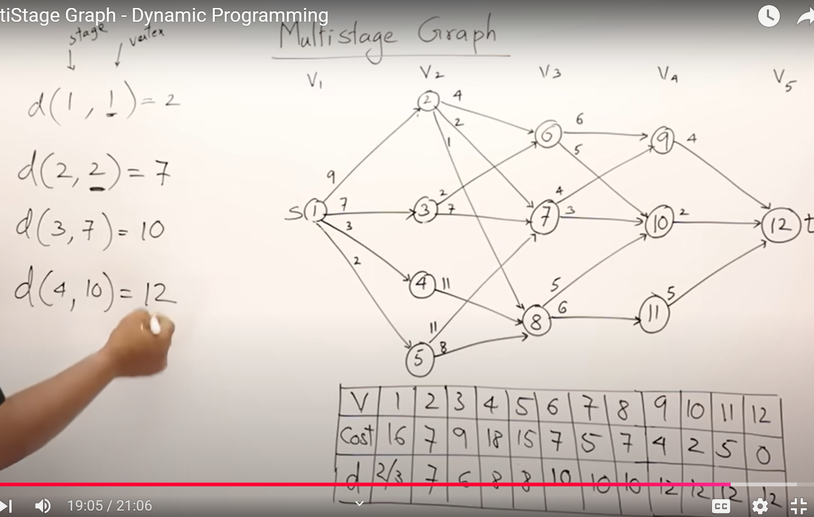
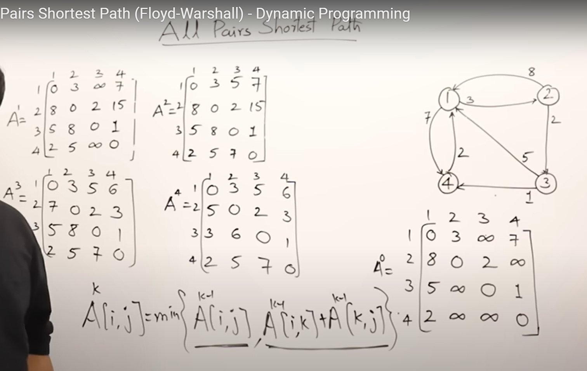

[Time-Complexity.pdf](./01-Time-Complexity.pdf) \
[Recursive BinarySearch](./recursive%20binary%20search.png) Note that recusive func declaration has `list, low, high and val` hence in the first call we have to give `l, 0, len(l)-1, val`


## 2.6.3 Heap Sort 

### Create a heap O(nlogn)
from the initial array
-  assume **first** element as** root **of heap
-  insert next element (left of root as at a level in heap elements are inserted left to right - due to property of **Complete Binary Tree** )
-  compare this element with root to see if it **maintains max heap prop** - if it is larger - move it upwards.
-  do it for rest of elements - insert as per  **Complete Binary Tree** and swap with parent chain as per **maintains max heap prop** 
-  Inserting one element at leaf takes O(1) - moving it upwards (worst case to root)  takes log(n) time - total elements are n - so Heap creation time complexity  **O(nlogn)**

## Delete from heap O(nlogn)
 
- delete root O(1) 
- put last element at root - as per **complete binary tree** prop *O(1)* 
- swap down the root element as per the **max heap prop** *O(logn)* 
- do for rest n times - *n*

## 2.7.1 Merging

- if two lists are already sorted - we merge them into one sorted list - by comparing element one by one.
- time taken is O(m+n) 

### Merge algo:

```
def merge_algo(A,B,m,m):
    i,j,k = 1,1,1

    while i < m and j < n:
        if A[i] < A[j]:
            C[k] = A[i]
            i += 1
        else:
            C[k] = B[j++]
            j += 1
        k += 1
    C.extend(A[i:])
    C.extend(B[j:])
```


### m-way merging

- if I have m lists and I merge all `m` of them together at a time - i.e. compare ith element of all of them at once
- but I can also take  any two at a time - merge them into one - then take next two - merge them into one and so on. this where m = 2 this is called 2-way merge.

### 2-way merge 

- iterative while merge sort is recursive.
- used to sort a single array.
- **assume an unsorted array of n elements is n sorted lists of 1 element** - now merge them using 2-way merge
- iteratively merge first two lists - then next two lists and so on - untill we get sorted lists with 2 elements
- now merge those sorted lists, again two at a time i.e. 2-way merge
- ultimately we get one sorted list
- n comparisons every pass - total log(n) pass = i.e. O(nlogn)


### Merge Sort

- it is a small variation of 2-way merge only
- uses divide and conqer therefore it is recursive
- **divide untill small - what is small - single element - why? because we don't have to sort a single element**
- merge the two single elements to become a sorted list
- this way we get multiple sorted list with two sorted elements
- now merge those sorted lists two at a time using 2-way merge
- again merge the resulting sorting lists using 2-way merge and so on untill we have on sorted list


pseudo code:
```
def merge_sort(l,h):
    if l < h:
        mid = (l + h ) // 2
        merge_sort(l, mid)k
        merge_sort(mid+1,h)
        merge(l,mid,h)
```

- Pros:
    - support very large size list 
    - linked list - if i have two sorted link list - we can merge them comapring one by one element by just chaging the next pointers without extra space.
    - support external sorting as it does divide and conquer so can sort and merge bite by bite in small memory
    - stable i.e. maintain the relative order of equal elements before and after sorting.
- Cons:
    - not in-place
    - no small problem: 
        - some algorithms that may switch to a different sorting technique for small arrays (as the overhead of recursion becomes relatively high for small problems), merge sort doesn't inherently include a direct approach to dealing with small arrays more efficiently within its basic structure.
        - array is continuously divided in half until the subarrays consist of only one element each. These one-element arrays are trivially sorted, because a single element does not need sorting. From there, merge sort begins the process of merging these atomic units back together in a way that results in a sorted array. This merging process is where the sorting happens
        - for n < 15 Insertion sort which is O(n^2) is found faster than merge sort which is O(nlogn) - because merge sort wastes lots of time in recursion
        - recursive hence needs stack of size log(n) - hence total space required is the n extra space and log(n) i.e. n+log(n)

# 2.8.1 Quicksort

- Analogy: kids are to be sorted in line as per height - teacher don't do it - teacher ask kids to do themselves.
- how they do it - they just see if they are in correct position themselves - i.e. all smaller are in front of them and all taller are behind them
- this is what pivot is - we start with any one element and bring it to it's correct position. how? - we start from left and right - and move elements if as per their comparison to pivot. 
    while i < j:
    - if ith element is larger, swap it at jth position and i++
    - if jth element is smaller, swap it at ith position and j--
    - at last swap pivot at position j


# 3. Greedy Method


Algorithms are called greedy when they utilize the greedy choice property and/or always make the locally optimal choice.
The choice made by a greedy algorithm may depend on choices made so far, but not on future choices or all the solutions to the subproblem
greedy algorithm never reconsiders its choices


## 3.2 Job sequencing with Deadlines

jobs are provided in decresing order of profit. 

all jobs take same 1 unit of time 

let' say job can start at 9am. max deadline among jobs is 3hr i.e. 12pm 

we take the job in order of proft, and assing it to first available slot before deadline. 

ie J2 needs to be done by 11 so assigned 10-11. then J1 needs to be done by 11. latest slot availabe 9-10. 



## 3.3 Optimal Merge pattern

if we have more than 2 list and want to follow 2-way merge - as per greedy method - **merge the smalles list first**

## 3.4 Huffman Coding

create custom codes depending on what all ASCII alphabets are present 




## 3.5 Prim's and Kruskal's

**Spanning Tree**: \
If a graph is defined as \
`G = (V,E) where V is set of vertex  and E is set of edges` \
then a tree \
`S = (V',E') where  V' = V, and |E'| = |V| - 1`\
is called Spanning Tree.

No of spanning tress = <sup>|E|</sup> C <sub>|V| - 1</sub> - no_of_cycles

Now how to find the spanning tree minimum cost ? We have two Greedy methods:

### Prim's Algo

Steps:

1. choose the least cost edge. now we have two vertex present.
2. choose the next least cost edge such that one of the vertex is already present 
3. repeat above step  untill we have `|E'| = |V| - 1`\

cannot give MST for disconnected graph

### Krshal's algo

Step:

- keep choosing the edges in ascending order of their cost unless if it is making a cycle then skip it.

Time complexity: We have to select the lowest cost edge always - so keep it in min heap thus O(nlogn)

Kruskal algo can give MST for disconnected graph

we can have only min cost - we can have diff set of edges though in the result set.

### Djikstra Algo

Single Source Shortest Path - this algo finds shortest path to all other nodes from one source. (directed path)

Steps: 
- if directly connected - the cost of edge is the final cost.
- if indirectly connected - assume it to be infinity at first.
- `Relaxation` i.e. let's say from a source `s` there are two nodes - one is direct `u` and other indirect `v`
- then 
```
if (d[u] + c[u,v] < d[v]):
    d[v] = d[u] + c[u,v]
```



the infinity of v is relaxed to `2 + 4 i.e. 6`

Repeating steps:

- mark cost as per 1 and 2.
- select the least cost node as next node. it's the `u`.
- from there - analyse all connected node one by one i.e. `v` and apply relaxation on them if applicable
- go to next least cost node


**Complexity**: 

For every n possible node, we have to find which is the lowest cost node among all directly connected  node. one node, at worst, can be connected to all n nodes.

thus n*n hence O(n^2)



Djikstra may or may not work with -ve path cost. Greedy approach fails here.

Dijkstra is greedy - because it doesn't find all possibilities and select min one - it founds the min at the current node and select it. this can be seen when -ve edge is there - though there was a less costlier path from 1 to 2 via 1 -> 4 -> 3 -> 2 but as per Djikstra we selected 2 from source.




# 4. Dynamic Programming (Principal of Optimality)

- Both greedy and DP are for solving optimality problems i.e. find min / max
- DP is solved using recursive formulae - we implement that using iteration
- Principal of Optimality = a problem can be solved by taking sequence of decision
- in greedy we take on one decision and follow that procedure
- in DP we take decision every stage

Fibonacci can be done using:
- recursion O(n^2)
- recusrion with memoisation O(n)
- **tabulation** (iteratively fill array from 0 to n)

Tabulation is a bottom up approach - and is mainly used in DP.

## 4.1 Multi-Stage graph

here every stage I have to decide which vertex to choose - so principle of optimality holds.

we will use tabualtion method to 
in table d is the vertex of the next stage




Using above formula we populate the table - the d value will give the vertex in next stage. Here choosing d value is the sequence of decision - thus **Dynamic Programming** !!




## 4.1.1. MultiStage Graph (Program) - DP

Graph is given as cost adjacency matrix.

For the two rows in table in prev video - we make two arrays cost and d.

for giving the final result_path - we create one array.

If number of vertices is n - set size of d, cost as n+1. So for 1st vertice you put at index 1. 
result_path = no of stages


`cost[n] = 0 ` as n is sink itself.

k > i as in multi-stage graph all edges go to next stage only.
To calc cost[i]k
    So k ranges from i to n
    i ranges from n to 1 (we calculate in reverse)
    we set cost[i] to be min of C[i][k] + C[k]

```python
for i in range(n-1,1,-1):
    min = sys.maxsize # infinity
    for k in range(i+1,n):
        if (C[i][k] !=0 and C[i][k] + C[k] < min):
            min = C[i][k] + C[k] # relaxation
            d[i] = k
    cost[i] = min

P[1] = 1
P[stages] = n
for i in range(2,stages):
    P[i] = P[d[i-1]]
```

## 4.2 All Pairs Shortest Path (Floyd Warshall)

Generate matrix of cost of traversing from ith vertex to jth vertex through kth vertex

k = 0 for original cost matrix
k = 1 for vertex 1 
.
.
. and so on

see - for A<sup>1</sup>, all paths through vertex 1 i.e. first row and first col - they will be same - so that you can put as it is from A<sup>0</sup>





Code:

```python

for k in range(1,n+1):
    for i in range(1,n+1):
        for j in range(1,n+1):
            A[i,j] = min(A[i,j], A[i,k] + A[k,j])
``` 

## 4.3 Matrix Chain Multiplication 4.3.1

Skipped - revisit if questions arise

## 4.4 Single Source Shortest Path

Dikstra algo also solves this - but not for -ve edges. 